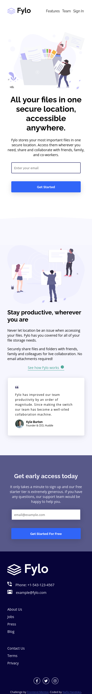

# Frontend Mentor - Fylo landing page with two column layout solution

This is a solution to the [Fylo landing page with two column layout challenge on Frontend Mentor](https://www.frontendmentor.io/challenges/fylo-landing-page-with-two-column-layout-5ca5ef041e82137ec91a50f5). Frontend Mentor challenges help you improve your coding skills by building realistic projects. 

## Table of contents

- [Overview](#overview)
  - [The challenge](#the-challenge)
  - [Screenshot](#screenshot)
  - [Links](#links)
- [My process](#my-process)
  - [Built with](#built-with)
  - [What I learned](#what-i-learned)
  - [Continued development](#continued-development)
  - [Useful resources](#useful-resources)
- [Author](#author)


## Overview

### The challenge

Users should be able to:

- View the optimal layout for the site depending on their device's screen size
- See hover states for all interactive elements on the page

### Screenshot




### Links

- Solution URL: [Code](https://github.com/NafisHandoko/fylo-landing-page)
- Live Site URL: [Github Pages](https://nafishandoko.github.io/fylo-landing-page/)


## My process

### Built with

- Semantic HTML5 markup
- CSS custom properties
- Flexbox
- Vanilla JS

### What I learned

We can shorten if syntax with ternary operator like this
```js
var x = 1;
var y = x===1 ? "it is one" : "no it isn't one";
```

I also learn how to remove default event on form submit using `preventDefault()` function.
```js
document.getElementById("myform").addEventListener("click",(e) => {
  e.preventDefault();
})
```

### Continued development

I think that building landing page with only HTML, CSS, and JS is tough. I know there are many frameworks like bootstrap or tailwindcss. Maybe in future projects i will prefer use that framework so i can build complex website more efficiently and faster than before

### Useful resources

- [HTML Semantic Elements](https://www.w3schools.com/html/html5_semantic_elements.asp)
- [CSS background-image property](https://www.w3schools.com/cssref/pr_background-image.asp)
- [HTML Forms](https://www.w3schools.com/html/html_forms.asp)
- [css - How do I create a div tag heading with a underline? - Stack Overflow](https://stackoverflow.com/questions/3022129/how-do-i-create-a-div-tag-heading-with-a-underline/32694969)
- [Font Awesome](https://fontawesome.com/)
- [Specificity | HTML Dog](https://htmldog.com/guides/css/intermediate/specificity/)
- [How do you use the ? : (conditional) operator in JavaScript? - Stack Overflow](https://stackoverflow.com/questions/6259982/how-do-you-use-the-conditional-operator-in-javascript)
- [html - How can I change or remove HTML5 form validation default error messages? - Stack Overflow](https://stackoverflow.com/questions/10361460/how-can-i-change-or-remove-html5-form-validation-default-error-messages)


## Author

- Website - [Nafis Handoko](https://nafishandoko.github.io)
- Frontend Mentor - [@nafishandoko](https://www.frontendmentor.io/profile/nafishandoko)
- Instagram - [@nafishandoko](https://www.instagram.com/nafishandoko)